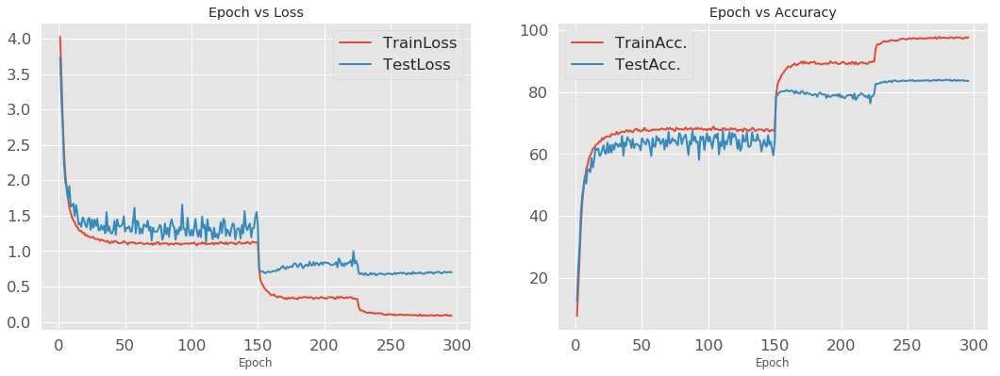

# Shake Drop regularization
PyTorch implementation of shake-drop regularization.
Author Torch implementations is [here](https://github.com/imenurok/ShakeDrop).

## Dependencies
- python 3.5+
- PyTorch 1.0.0

## Accuracy

### CIFAR-100
|Model|Method|Level|Alpha|Beta|This implementaion |Paper|
|:---:|:---:|:---:|:---:|:---:|:---:|:---:|
|PyramidNet|ShakeDrop|Batch|[-1, 1]|[0, 1]|83.90|83.78|



## Train PyramidNet(depth=110, alpha=270) with shake-drop for CIFAR-100
```bash
python train.py --epochs 300 --batch_size 128 --label 100 --lr 0.5 --depth 110 --alpha 270 --snapshot_interval 10
```

## References
Yoshihiro Yamada, Masakazu Iwamura, Koichi Kise. "ShakeDrop regularization"
[ICLR2017 OpenReview](https://openreview.net/forum?id=S1NHaMW0b)

Yoshihiro Yamada, Masakazu Iwamura, Takuya Akiba, Koichi Kise. "
ShakeDrop Regularization for Deep Residual Learning"
[arXiv:1802.02375v2](https://arxiv.org/abs/1802.02375)

